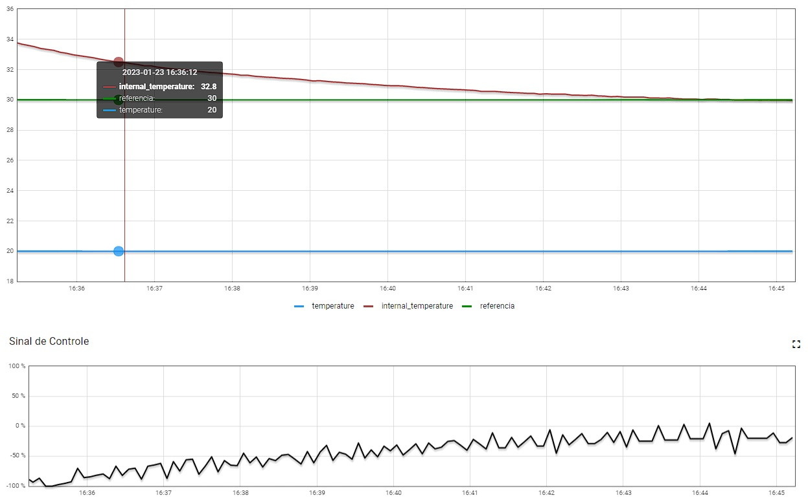
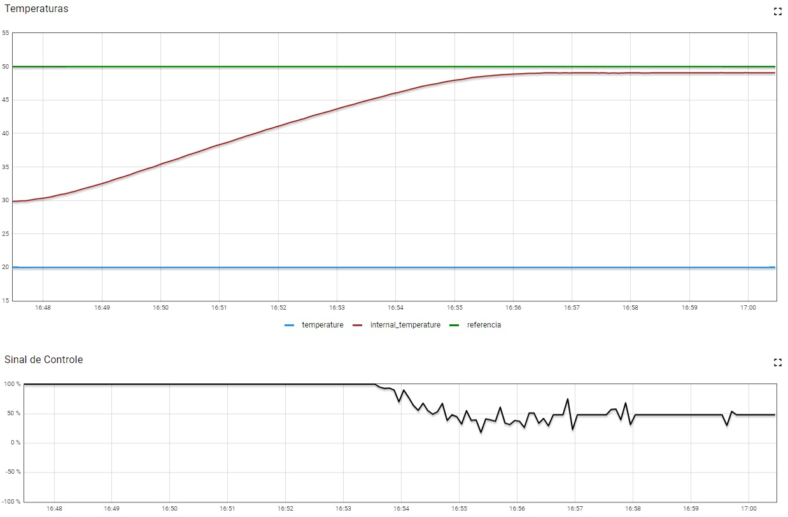
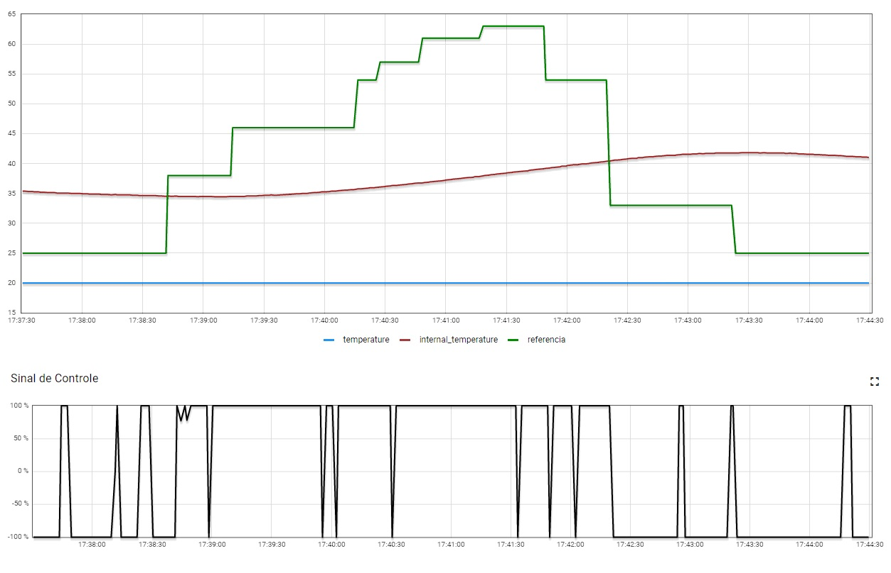

# FSE-Trabalho2
Trabalho 2 da disciplina de FSE 2022/2

Este trabalho tem por objetivo a implementação de um sistema (que simula) o controle de um forno para soldagem de placas de circuito impresso (PCBs). No trabalho, o software desenvolvido terá que efetuar o controle de temperatura do forno utilizando dois atuadores para este controle: um resistor de potência de 15 Watts utilizado para aumentar temperatura e uma ventoinha que puxa o ar externo (temperatura ambiente) para reduzir a temperatura do sistema.

Nome: Davi Marinho da Silva Campos 
Matrícula: 19/0026600

## Iniciar
Na pasta raiz utilize o comando:
```
make ou make all
```
Depois execute o binário gerado. Para isso, pode-se utilizar o comando a seguir na pasta raiz:
```
bin/bin
```

## Uso do programa
* Ao iniciar o programa, o usuário deve preencher os valores `Kp, Ki, Kd` para o controle PID.  
* Após isso, seleciona o modo de controle, ou seja, se a temperatura de referência será dada pelo `dashboard` ou pela `curva de reflow`
* Para encerrar o programa utilize `Ctrl + C`


## Gráficos do funcionamento

### Dashboard





### Curva de Reflow



